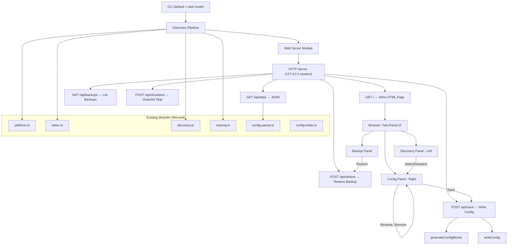

# Design Document: Web Config UI

## Overview

This feature adds a browser-based configuration UI to the existing `aws-sso-config-gen` CLI tool. The web UI is the default mode — running the tool without flags opens the browser. Users who need terminal-only mode for scripting use `--cli`. The web mode runs the existing Discovery_Pipeline, starts a lightweight local HTTP server using Node.js built-in `http` module, and opens a two-panel browser interface. The left panel shows discovered SSO profiles grouped by production status; the right panel shows the current `~/.aws/config` and any profiles selected for addition. Users can rename profiles inline, then save — which creates a backup and appends selected profiles to the config file. The server stays running after save so users can view and restore previous backups.

The entire frontend is served as a single inline HTML page embedded in a TypeScript module (`src/web-ui.ts`), with no external dependencies, no build step, and no separate static files. The backend exposes REST endpoints: `GET /api/data`, `POST /api/save`, `GET /api/backups`, `POST /api/restore`, and `POST /api/shutdown`. This keeps the tool self-contained as a single npm package.

### Key Design Decisions

1. **Web UI is the default mode** — No flags needed. `--cli` activates terminal-only mode.
2. **Node.js built-in `http` module** — No Express needed for a handful of endpoints and one HTML page.
3. **Inline HTML/CSS/JS** — The entire UI is a template string in `src/web-ui.ts`, avoiding static file serving complexity.
4. **Vanilla frontend** — No React, no framework. Plain HTML, CSS, and JavaScript keep the bundle zero-dependency on the frontend side.
5. **Server stays running after save** — Users can restore backups or make additional changes without restarting.
6. **Reuse existing modules** — `platform.ts`, `token.ts`, `discovery.ts`, `naming.ts`, `config-parser.ts`, `config-writer.ts`, and `types.ts` are all reused directly.

## Architecture



### Request Flow

1. User runs `./aws-sso-config-gen` (web mode is default) or `./aws-sso-config-gen --web`
2. CLI parses flags, detects web mode, warns if conflicting flags (`--write`, `--interactive`, `--output`) are present
3. Discovery Pipeline runs: `resolvePlatformPaths()` → `readCachedToken()` → `discoverAccountsAndRoles()` → `generateProfileNames()`
4. `startWebServer()` binds to `127.0.0.1:0` (OS-assigned port), stores discovery data in closure
5. Browser auto-opens via platform-specific command (`open` / `xdg-open` / `start`)
6. Browser loads `GET /` → receives inline HTML page
7. Page JS calls `GET /api/data` → receives profiles, existing config, SSO metadata
8. User interacts: selects profiles, renames, removes
9. User clicks Save → `POST /api/save` with selected profiles and custom names
10. Server calls `generateConfigBlocks()` + `writeConfig()`, responds with result
11. UI refreshes to show updated config; server stays running
12. User can view/restore backups via Backup Panel, or click Done/close browser
13. User clicks Done or sends SIGINT → server shuts down, CLI exits

## Components and Interfaces

### New Modules

#### `src/web-server.ts` — HTTP Server Lifecycle

Responsible for creating, starting, and stopping the local HTTP server. Handles routing and request/response processing.

```typescript
export interface WebServerOptions {
  profiles: GeneratedProfile[];
  existingConfig: ExistingConfig;
  configPath: string;
  ssoStartUrl: string;
  ssoRegion: string;
  sessionName: string;
  defaultRegion: string;
  outputFormat: string;
}

export interface WebServerHandle {
  url: string;       // e.g. "http://127.0.0.1:54321"
  port: number;
  close: () => Promise<void>;
}

/** Start the web server and return a handle for lifecycle management. */
export function startWebServer(options: WebServerOptions): Promise<WebServerHandle>;
```

Internal routing:
- `GET /` → serves the inline HTML from `web-ui.ts`
- `GET /api/data` → returns discovery data as JSON
- `POST /api/save` → accepts selected profiles, writes config, returns result
- `GET /api/backups` → lists available backup files with timestamps
- `POST /api/restore` → restores a selected backup file
- `POST /api/shutdown` → initiates graceful shutdown
- All other routes → 404

#### `src/web-ui.ts` — Inline HTML Page

Exports a single function that returns the complete HTML page as a string.

```typescript
/** Returns the complete HTML/CSS/JS for the web UI as a single string. */
export function renderWebUI(): string;
```

The HTML includes:
- CSS for the two-panel responsive layout (900px–1920px)
- Semantic HTML structure with proper labels and ARIA attributes
- Vanilla JavaScript for all interactivity (fetch API calls, DOM manipulation, validation)

#### `src/browser.ts` — Cross-Platform Browser Opening

```typescript
/** Open a URL in the user's default browser. Returns true if the command was spawned. */
export function openBrowser(url: string): boolean;
```

Uses `child_process.spawn` with:
- macOS: `open <url>`
- Linux: `xdg-open <url>`
- Windows: `cmd /c start "" "<url>"`

### Modified Modules

#### `src/cli.ts` — Default Web Mode + `--cli` Flag

- Web mode is the default when no `--cli` flag is present
- Add `--cli` flag to activate terminal-only mode (preserves existing behavior)
- Keep `--web` as an explicit alias for web mode
- When in web mode: warn if `--write`, `--interactive`, `--output`, or `--force` are also set
- Run Discovery Pipeline, then call `startWebServer()` instead of the normal output pipeline
- Call `openBrowser()` after server starts
- Wait for server to close before exiting

### API Contracts

#### `GET /api/data`

Response `200 OK`:
```json
{
  "profiles": [
    {
      "profileName": "my-account-admin",
      "accountId": "123456789012",
      "accountName": "My Account",
      "roleName": "AdministratorAccess",
      "isProduction": false
    }
  ],
  "existingConfig": {
    "raw": "[profile existing]\nregion = us-east-1\n...",
    "profileNames": ["existing"]
  },
  "sso": {
    "startUrl": "https://myorg.awsapps.com/start",
    "region": "us-east-1",
    "sessionName": "myorg",
    "defaultRegion": "us-east-1",
    "outputFormat": "json"
  }
}
```

#### `POST /api/save`

Request body:
```json
{
  "selections": [
    {
      "originalProfileName": "my-account-admin",
      "customProfileName": "my-custom-name",
      "accountId": "123456789012",
      "accountName": "My Account",
      "roleName": "AdministratorAccess",
      "isProduction": false
    }
  ]
}
```

Response `200 OK`:
```json
{
  "success": true,
  "writtenCount": 2,
  "backupPath": "/home/user/.aws/config.bak.20250101T120000000Z"
}
```

Response `500`:
```json
{
  "success": false,
  "error": "Cannot write to /home/user/.aws/config: permission denied."
}
```

#### `POST /api/shutdown`

Response `200 OK`:
```json
{ "ok": true }
```

Server shuts down after sending the response.

#### `GET /api/backups`

Response `200 OK`:
```json
{
  "backups": [
    {
      "filename": "config.bak.20250414T190700000Z",
      "path": "/home/user/.aws/config.bak.20250414T190700000Z",
      "timestamp": "2025-04-14T19:07:00.000Z",
      "size": 1234
    }
  ]
}
```

#### `POST /api/restore`

Request body:
```json
{
  "backupPath": "/home/user/.aws/config.bak.20250414T190700000Z"
}
```

Response `200 OK`:
```json
{
  "success": true,
  "newBackupPath": "/home/user/.aws/config.bak.20250414T193000000Z",
  "restoredFrom": "/home/user/.aws/config.bak.20250414T190700000Z"
}
```

Response `500`:
```json
{
  "success": false,
  "error": "Cannot read backup file: permission denied."
}
```

### Frontend Architecture

The inline HTML page uses a simple state-driven approach:

```
State = {
  profiles: GeneratedProfile[],       // from /api/data
  existingProfileNames: Set<string>,   // from /api/data
  existingConfigRaw: string,           // from /api/data
  selectedProfiles: Map<string, {      // keyed by original profileName
    originalName: string,
    customName: string,
    accountId: string,
    accountName: string,
    roleName: string,
    isProduction: boolean
  }>,
  validationErrors: Map<string, string>, // keyed by original profileName
  saving: boolean,
  saveResult: { success, writtenCount, backupPath, error } | null
}
```

All DOM updates are driven by re-rendering functions that read from this state object. No virtual DOM — just targeted `innerHTML` updates on the two panels when state changes.

### Validation Logic (Frontend)

Profile name validation runs on every keystroke in a rename field:

1. Apply `sanitizeName()` rules (lowercase, replace non-alphanumeric with hyphens, collapse, trim)
2. Check for empty result → error: "Profile name is required"
3. Check against `existingProfileNames` → error: "Profile name already exists in config"
4. Check against other selected profiles' custom names → error: "Duplicate profile name"
5. If no errors, clear validation state for that profile

The Save button is disabled when `selectedProfiles.size === 0` or `validationErrors.size > 0`.

## Data Models

### Discovery Data (Server → Client)

The `/api/data` endpoint returns a `DiscoveryDataResponse`:

```typescript
interface DiscoveryDataResponse {
  profiles: Array<{
    profileName: string;
    accountId: string;
    accountName: string;
    roleName: string;
    isProduction: boolean;
  }>;
  existingConfig: {
    raw: string;
    profileNames: string[];  // serialized from Set<string>
  };
  sso: {
    startUrl: string;
    region: string;
    sessionName: string;
    defaultRegion: string;
    outputFormat: string;
  };
}
```

### Save Request (Client → Server)

```typescript
interface SaveRequest {
  selections: Array<{
    originalProfileName: string;
    customProfileName: string;
    accountId: string;
    accountName: string;
    roleName: string;
    isProduction: boolean;
  }>;
}
```

### Save Response (Server → Client)

```typescript
interface SaveResponse {
  success: boolean;
  writtenCount?: number;
  backupPath?: string;
  error?: string;
}
```

### Frontend State

```typescript
interface UIState {
  profiles: GeneratedProfile[];
  existingProfileNames: Set<string>;
  existingConfigRaw: string;
  selectedProfiles: Map<string, SelectedProfile>;
  validationErrors: Map<string, string>;
  saving: boolean;
  saveResult: SaveResponse | null;
}

interface SelectedProfile {
  originalName: string;
  customName: string;
  accountId: string;
  accountName: string;
  roleName: string;
  isProduction: boolean;
}
```

## Correctness Properties

*A property is a characteristic or behavior that should hold true across all valid executions of a system — essentially, a formal statement about what the system should do. Properties serve as the bridge between human-readable specifications and machine-verifiable correctness guarantees.*

### Property 1: API data response completeness

*For any* set of discovered profiles, existing config content, and SSO metadata passed to the web server, the `GET /api/data` JSON response SHALL contain every profile with all fields (profileName, accountId, accountName, roleName, isProduction), the raw config string, all existing profile names, and all SSO session fields (startUrl, region, sessionName, defaultRegion, outputFormat).

**Validates: Requirements 3.1, 3.2, 3.3**

### Property 2: Already-configured profiles are correctly identified

*For any* set of discovered profiles and any set of existing profile names from the config file, a discovered profile SHALL be marked as "already configured" (disabled) if and only if its profile name appears in the existing profile names set.

**Validates: Requirements 4.4**

### Property 3: Frontend sanitization equivalence

*For any* input string, the sanitization logic applied in the web UI to profile name edits SHALL produce the same result as the backend `sanitizeName` function (lowercase, replace non-alphanumeric with hyphens, collapse consecutive hyphens, trim leading/trailing hyphens).

**Validates: Requirements 6.2**

### Property 4: Duplicate profile name detection

*For any* set of existing profile names and any set of selected profiles with custom names, a validation error SHALL be reported for a selected profile if and only if its custom name (after sanitization) matches an existing profile name OR matches another selected profile's custom name.

**Validates: Requirements 6.3**

### Property 5: Save button disabled invariant

*For any* UI state, the Save button SHALL be disabled if and only if the set of selected profiles is empty OR the set of validation errors is non-empty.

**Validates: Requirements 7.5**

## Error Handling

### Server-Side Errors

| Error Source | Handling |
|---|---|
| Discovery Pipeline failure (TokenExpiredError, TokenNotFoundError, AuthorizationError, NetworkError, MissingStartUrlError) | Caught before server starts. Same `handleError()` path as non-web mode. Exit code 1, no server started. |
| Config file read error (EACCES) | Caught during `parseExistingConfig()` before server starts. Same error handling as CLI mode. |
| Config file write error during save (EACCES) | Caught in `POST /api/save` handler. Returns `{ success: false, error: "..." }` with HTTP 500. Frontend displays the error message. |
| Malformed save request body (invalid JSON, missing fields) | Returns HTTP 400 with `{ success: false, error: "Invalid request" }`. |
| Unexpected server error | Returns HTTP 500 with generic error message. Logged to stderr. |

### Client-Side Errors

| Error Source | Handling |
|---|---|
| `/api/data` fetch failure | Display error banner: "Failed to load discovery data. Please restart the tool." |
| `/api/save` fetch failure (network) | Display error banner: "Failed to save. Check that the server is still running." |
| `/api/save` returns `success: false` | Display the `error` message from the response inline in the config panel. |
| Validation error (empty name) | Inline error below the text field: "Profile name is required." Save button disabled. |
| Validation error (duplicate name) | Inline error below the text field: "Profile name already exists." Save button disabled. |

### Signal Handling

- `SIGINT` / `SIGTERM`: The server closes all connections and exits. No partial config writes occur because the write operation is atomic (the entire `appendFileSync` call completes or doesn't start).

### Browser Open Failure

- If `openBrowser()` fails (command not found, etc.), the CLI prints the URL to stdout and continues. The user can manually navigate to the URL. This is not a fatal error.

## Testing Strategy

### Unit Tests

Unit tests cover specific examples, edge cases, and component wiring:

- **`web-server.test.ts`**:
  - Server binds to 127.0.0.1 on a random port
  - `GET /` returns HTML with correct content-type
  - `GET /api/data` returns correct JSON structure for a known set of profiles
  - `POST /api/save` calls `generateConfigBlocks` and `writeConfig` with correct arguments
  - `POST /api/save` returns error response when `writeConfig` throws `ConfigWriteError`
  - `POST /api/shutdown` triggers graceful shutdown
  - Unknown routes return 404
  - Malformed POST body returns 400

- **`web-ui.test.ts`**:
  - `renderWebUI()` returns valid HTML with no external CDN references
  - HTML contains semantic elements (headings, buttons, labels)
  - HTML contains both "Production" and "Non-Production" section structure
  - Production profile cards include ⚠️ indicator markup
  - All form inputs have associated labels or aria-label attributes

- **`browser.test.ts`**:
  - Correct command is spawned for each platform (darwin → `open`, linux → `xdg-open`, win32 → `cmd`)
  - Returns false when spawn fails

- **`cli.test.ts`** (additions):
  - `--web` flag triggers web server mode
  - `--web` with `--write` logs a warning
  - `--web` with `--interactive` logs a warning
  - `--web` with `--output` logs a warning
  - Discovery failure in web mode shows error and exits with code 1

### Property-Based Tests

Property-based tests use `fast-check` (already a dev dependency) with minimum 100 iterations per property.

- **`web-server.property.test.ts`**:
  - **Property 1**: API data response completeness — generate random profiles, config, and SSO metadata; verify `/api/data` response contains all data.
    Tag: `Feature: web-config-ui, Property 1: API data response completeness`
  - **Property 2**: Already-configured profiles identification — generate random profile sets and existing name sets; verify correct disabled marking.
    Tag: `Feature: web-config-ui, Property 2: Already-configured profiles are correctly identified`

- **`web-validation.property.test.ts`**:
  - **Property 3**: Frontend sanitization equivalence — generate random strings; verify frontend sanitization matches `sanitizeName()`.
    Tag: `Feature: web-config-ui, Property 3: Frontend sanitization equivalence`
  - **Property 4**: Duplicate profile name detection — generate random existing names and selected profile names; verify correct conflict detection.
    Tag: `Feature: web-config-ui, Property 4: Duplicate profile name detection`
  - **Property 5**: Save button disabled invariant — generate random UI states; verify disabled condition.
    Tag: `Feature: web-config-ui, Property 5: Save button disabled invariant`

### Integration Tests

- Start the full web server, make HTTP requests, verify end-to-end flow
- Save operation creates backup and appends to config file
- Server shuts down after save completes
- Signal handling (SIGINT) results in clean shutdown
