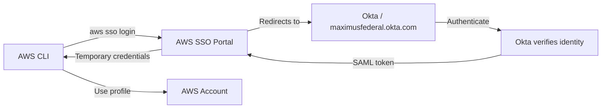
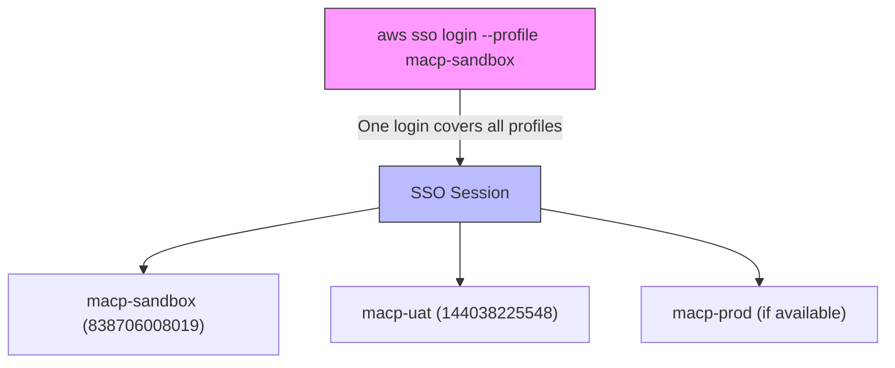
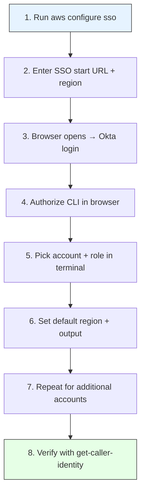
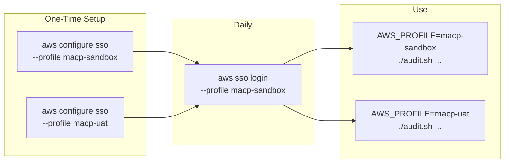

# AWS SSO Setup Guide — Maximus Federal

## How It Works



Your browser handles the Okta authentication automatically — the CLI just opens the link and waits for the token.

## Multi-Account Access

One SSO login gives you access to all accounts your role is assigned to:



## Prerequisites

- **AWS CLI v2** installed (`aws --version` should show 2.x)
- Access to the [Maximus Federal Okta portal](https://maximusfederal.okta.com)
- AWS SSO app assigned to your Okta account (ask your admin if you don't see it)

## Setup Steps



### Step 1 — Configure the sandbox profile

```bash
aws configure sso --profile macp-sandbox
```

### Step 2 — Enter SSO details when prompted

| Prompt | Value |
|---|---|
| SSO session name | `maxfed` (or press Enter to skip) |
| SSO start URL | `https://d-90676bd4b4.awsapps.com/start` |
| SSO region | `us-east-1` |
| SSO registration scopes | press Enter (default) |

### Step 3 — Authenticate in browser

The CLI opens your browser automatically. Okta intercepts the request — log in with your Maximus credentials (and MFA if prompted).

### Step 4 — Authorize the CLI

The browser shows an authorization page. Click **Allow** to grant the CLI access.

### Step 5 — Pick account and role

Back in the terminal, the CLI lists your available accounts:

```
There are N accounts available to you.
> 838706008019 (macp-sandbox)
  144038225548 (macp-uat)
  ...
```

Select `838706008019` for sandbox, then pick your role (e.g., `MaxFedPowerUser`).

### Step 6 — Set defaults

| Prompt | Value |
|---|---|
| CLI default client Region | `us-east-1` |
| CLI default output format | `json` (or press Enter) |

### Step 7 — Repeat for UAT (and any other accounts)

```bash
aws configure sso --profile macp-uat
```

Same SSO start URL and region — it won't re-open the browser since you're already authenticated. Just pick account `144038225548` and the same role.

Add as many profiles as you need:

```bash
aws configure sso --profile macp-prod
# pick the prod account + role
```

### Step 8 — Verify

```bash
aws sts get-caller-identity --profile macp-sandbox
aws sts get-caller-identity --profile macp-uat
```

You should see the correct account ID and role for each.

## What your `~/.aws/config` looks like after setup

```ini
[profile macp-sandbox]
sso_session = maxfed
sso_account_id = 838706008019
sso_role_name = MaxFedPowerUser
region = us-east-1
output = json

[profile macp-uat]
sso_session = maxfed
sso_account_id = 144038225548
sso_role_name = MaxFedPowerUser
region = us-east-1
output = json

[sso-session maxfed]
sso_start_url = https://d-90676bd4b4.awsapps.com/start
sso_region = us-east-1
sso_registration_scopes = sso:account:access
```

> Note: The `[sso-session maxfed]` block is shared — all profiles reference it, so one login covers everything.

## Daily Usage

### Login (once per session, lasts ~4 hours)

```bash
aws sso login --profile macp-sandbox
```

### Switch between accounts

No re-login needed — just set the profile:

```bash
# Interactive use
export AWS_PROFILE=macp-sandbox
aws s3 ls

# Or per-command
aws s3 ls --profile macp-uat
```

### Run audits

```bash
cd evalawsenvironment

AWS_PROFILE=macp-sandbox ./audit.sh --name macp-sandbox --regions us --csv --days 60
AWS_PROFILE=macp-uat     ./audit.sh --name macp-uat     --regions us --csv --days 60
```

### Re-login when session expires

Sessions expire after ~4 hours. You'll see an error like `The SSO session has expired or is invalid`. Just run:

```bash
aws sso login --profile macp-sandbox
```

## Troubleshooting

| Problem | Fix |
|---|---|
| `Error loading SSO Token` | Run `aws sso login --profile <name>` to refresh |
| Browser doesn't open | Copy the URL from the terminal and paste it manually |
| No accounts listed | Your Okta user may not have the AWS SSO app assigned — contact your admin |
| Wrong role/permissions | Re-run `aws configure sso --profile <name>` and pick a different role |
| `ExpiredTokenException` | SSO session expired — re-login |

## Quick Reference


